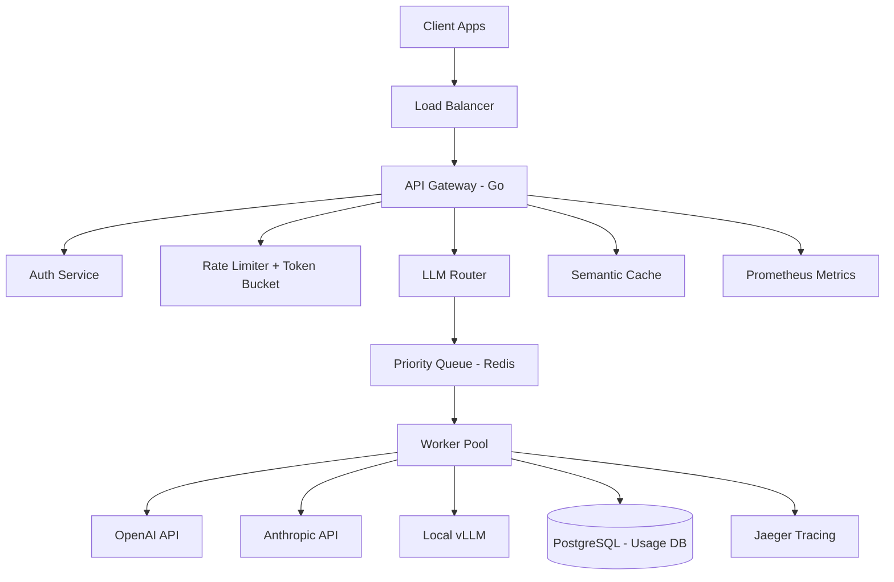

# AI Gateway Microservices

[](https://golang.org/)
[](https://opensource.org/licenses/MIT)
[](https://www.docker.com/)

High-performance Go backend for AI service routing, request queuing, token management, and observability for LLM applications.

## 🎯 Key Features

### API Gateway
- **Multi-Provider Routing**: Unified interface for OpenAI, Anthropic, Cohere, local models
- **Intelligent Failover**: Automatic fallback if primary provider unavailable
- **Cost Optimization**: Route to cheapest model based on query complexity
- **Request Normalization**: Consistent request/response format across providers

### Performance
- **Sub-10ms p99 Latency**: For cache hits
- **Semantic Caching**: Reduce costs by ~35%
- **Connection Pooling**: Reuse HTTP connections
- **Async Processing**: Non-blocking request handling
- **100+ requests/sec**: Single instance throughput

### Request Management
- **Priority Queue**: Redis-based request scheduling
- **Batch Processing**: Group requests for efficiency
- **Streaming Support**: Server-Sent Events for real-time responses
- **Retry Logic**: Exponential backoff with jitter
- **Circuit Breaker**: Prevent cascade failures

### Observability
- **Distributed Tracing**: OpenTelemetry + Jaeger
- **Prometheus Metrics**: Latency, throughput, costs, errors
- **Structured Logging**: JSON logs with correlation IDs
- **Grafana Dashboards**: Pre-built monitoring dashboards

### Security & Rate Limiting
- **JWT Authentication**: Secure API access
- **API Key Management**: Per-organization keys
- **Token-based Rate Limiting**: Fair usage enforcement
- **Usage Tracking**: Per-user token consumption
- **Billing Integration**: Cost calculation and quotas

## 🏗️ Architecture



## 🚀 Quick Start

### Prerequisites
- Go 1.22+
- Redis
- PostgreSQL
- Docker (optional)

### Installation

```bash
git clone https://github.com/sanketny8/ai-gateway-microservices.git
cd ai-gateway-microservices

# Install dependencies
go mod download

# Copy config
cp config.example.yaml config.yaml
# Edit config.yaml

# Run migrations
make migrate-up

# Start the server
make run

# Or with Docker
docker-compose up
```

### Usage

```bash
# Health check
curl http://localhost:8080/health

# Generate completion
curl -X POST http://localhost:8080/v1/chat/completions \
  -H "Authorization: Bearer your-api-key" \
  -H "Content-Type: application/json" \
  -d '{
    "model": "gpt-4",
    "messages": [{"role": "user", "content": "Hello!"}]
  }'

# Check usage
curl http://localhost:8080/v1/usage \
  -H "Authorization: Bearer your-api-key"
```

## 📊 Performance Benchmarks

| Metric | Value |
|--------|-------|
| **p50 Latency** | 3ms (cache hit) / 450ms (cache miss) |
| **p95 Latency** | 8ms (cache hit) / 1.2s (cache miss) |
| **p99 Latency** | 15ms (cache hit) / 2.5s (cache miss) |
| **Throughput** | 120 req/s (single instance) |
| **Cache Hit Rate** | 32-38% (production workload) |
| **Cost Reduction** | 35% via caching |

Load tested with 10K concurrent users, 500K requests.

## 🔧 Configuration

```yaml
server:
  host: 0.0.0.0
  port: 8080
  read_timeout: 30s
  write_timeout: 30s

providers:
  openai:
    api_key: ${OPENAI_API_KEY}
    base_url: https://api.openai.com/v1
    timeout: 60s
  anthropic:
    api_key: ${ANTHROPIC_API_KEY}
    base_url: https://api.anthropic.com
    timeout: 60s
  vllm:
    base_url: http://localhost:8001
    timeout: 30s

cache:
  enabled: true
  ttl: 3600
  similarity_threshold: 0.95
  redis_url: redis://localhost:6379

rate_limiting:
  enabled: true
  requests_per_minute: 60
  requests_per_hour: 1000
  token_budget: 100000

database:
  host: localhost
  port: 5432
  name: ai_gateway
  user: postgres
  password: ${DB_PASSWORD}
```

## 🛠️ API Endpoints

### Chat Completions
```
POST /v1/chat/completions
```

### Embeddings
```
POST /v1/embeddings
```

### Usage Stats
```
GET /v1/usage
GET /v1/usage/costs
```

### Admin
```
POST /v1/admin/api-keys
GET /v1/admin/users
GET /v1/admin/metrics
```

## 📈 Monitoring

### Prometheus Metrics
- `http_requests_total`: Total HTTP requests
- `http_request_duration_seconds`: Request latency histogram
- `llm_tokens_total`: Total tokens processed
- `llm_costs_total`: Total costs incurred
- `cache_hit_total`: Cache hit counter
- `provider_errors_total`: Provider error counter

### Grafana Dashboards
- Gateway Overview
- LLM Provider Performance
- Cost Tracking
- Rate Limiting Stats

## 🧪 Development

### Run Tests
```bash
make test
make test-integration
make test-load
```

### Code Quality
```bash
make lint
make fmt
make vet
```

### Build
```bash
make build
make docker-build
```

## 🐳 Docker Deployment

```bash
# Build image
docker build -t ai-gateway:latest .

# Run with docker-compose
docker-compose up -d

# Scale workers
docker-compose up -d --scale worker=3
```

## 📚 Documentation

- [Architecture](docs/ARCHITECTURE.md)
- [API Reference](docs/API.md)
- [Caching Strategy](docs/CACHING.md)
- [Routing Logic](docs/ROUTING.md)
- [Deployment Guide](docs/DEPLOYMENT.md)

## 🔐 Security

- JWT authentication
- API key rotation
- Rate limiting per user/org
- Request validation
- Audit logging
- Secrets management

## 📄 License

MIT License

## 📞 Contact

**Author**: Sanket Nyayadhish  
**Twitter**: [@Ny8Sanket](https://twitter.com/Ny8Sanket)

---

⭐ Star this repo if you find it useful!

